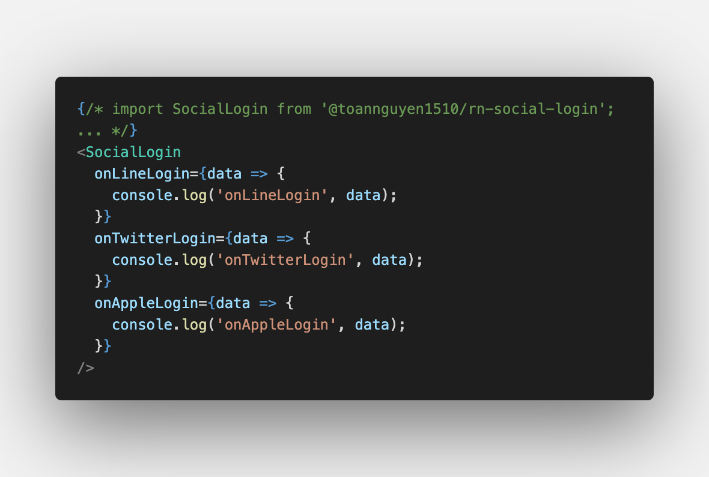

# Usage
# 

# ENV formatting after setting config env in native
```
  #LINE
  CHANNEL_ID=

  #TWITTER
  TWITTER_API_KEY=
  TWITTER_API_SECRET_KEY=

  #APPLE
  CLIENT_ID=
  CALLBACK_APPLE=
```
<details>
<summary>Line Login</summary>

<p align="center">
  Line SDK wrapper for React Native 🚀
</p>

This library includes:

- [LINE SDK v5 for iOS Swift](https://developers.line.biz/en/docs/ios-sdk/swift/overview/), wrapped with [Swift](https://developer.apple.com/swift/).
- [LINE SDK v5 for Android](https://developers.line.biz/en/docs/android-sdk/overview/), wrapped with [Kotlin](https://kotlinlang.org/).


## Requirements

- React native `>=0.61.1`
- iOS 10.0 or later as the development target
- Android `minSdkVersion` set to 17 or higher
- [LINE developer account](https://developers.line.biz/console/) with a channel created.

### iOS Setup

#### Using Objective-C

Inside your `AppDelegate.m`, setup the line sdk by passing the channel id obtained.

1. Add `platform :ios, '10.0'` in `Podfile` line:1
2. Enable `use_frameworks!` in `Podfile` line:3
3. Comment the code related to flipper, flipper doesn't support `use_frameworks!` !
4. Modify your info.plist like it says here [Configuring the Info.plist file](https://developers.line.biz/en/docs/ios-sdk/swift/setting-up-project/#configuring-the-info-plist-file)
5. Change your `AppDelegate.m` to match the following:

```objc
// AppDelegate.m

//
// Import the Library
//
#import "RNLine-Swift.h"

//
// Setup the plugin using your CHANNEL_ID when the app finishes launching
//
- (BOOL)application:(UIApplication *)application didFinishLaunchingWithOptions:(NSDictionary *)launchOptions
{
    [LineLogin setupWithChannelID:@"YOUR_CHANNEL_ID" universalLinkURL:nil];
}

//
// Handle redirection back to the app from Line
//
- (BOOL)application:(UIApplication *)app openURL:(NSURL *)url options:(NSDictionary<UIApplicationOpenURLOptionsKey,id> *)options
{
  return [LineLogin application:app open:url options:options];
}

- (BOOL)application:(UIApplication *)application continueUserActivity:(NSUserActivity *)userActivity restorationHandler:(void (^)(NSArray<id<UIUserActivityRestoring>> * _Nullable))restorationHandler
{
  BOOL handledLine = [LineLogin application:application continue:userActivity restorationHandler:restorationHandler];
  return handledLine;
}
```

#### Using Swift

1. Follow instructions in [Integrating LINE Login with your iOS app](https://developers.line.biz/en/docs/ios-sdk/swift/integrate-line-login/).
2. Change your `AppDelegate.m` to match the following:

```swift
// AppDelegate.swift

//
// Import the Library
//
import LineLogin

//
// Setup the plugin using your CHANNEL_ID when the app finishes launching
//
func application(_ application: UIApplication, didFinishLaunchingWithOptions launchOptions: [UIApplication.LaunchOptionsKey: Any]?) -> Bool {
    LineLogin.setup(channelID: "YOUR_CHANNEL_ID", universalLinkURL: nil)

    return true
}

//
// Handle redirection back to the app from Line
//
func application(_ app: UIApplication, open url: URL, options: [UIApplication.OpenURLOptionsKey : Any] = [:]) -> Bool {
    return LineLogin.application(app, open: url, options: options)
}
```

Don't forget to add `application` function, as line's instructions indicate.

### Android Setup

1. Follow all the configuration steps in [Line's Android integration guide](https://developers.line.biz/en/docs/android-sdk/integrate-line-login/)
2. Add the string `line_channel_id` to your strings file with the the channel id that you have on your line console.

```xml
<string name="line_channel_id" translatable="false">Your channel id here</string>
```

3. Add `minSdkVersion = 17` in `android/build.gradle`
4. In your manifest add `xmlns:tools="http://schemas.android.com/tools"` in your `manifest` tag and also `tools:replace="android:allowBackup"` in your `application` tag

## API

First, require the `LineLogin` module:

```javascript
import LineLogin from '@xmartlabs/react-native-line'
```

Then, you can start using all the functions that are available:

| Function                                                 | Description                                                                                                                                                                                                                        |
| -------------------------------------------------------- | ---------------------------------------------------------------------------------------------------------------------------------------------------------------------------------------------------------------------------------- |
| `login(args?: LoginArguments): Promise<LoginResult>`     | Starts the login flow of Line's SDK (Opens the apps if it's installed and defaults to the browser otherwise). It accepts the same argumements as the LineSDK, in an object `{ key: value }`, defaults the same way as LineSDK too. |
| `getCurrentAccessToken(): Promise<AccessToken>`          | Returns the current access token for the currently logged in user.                                                                                                                                                                 |
| `getProfile(): Promise<UserProfile>`                     | Returns the profile of the currently logged in user.                                                                                                                                                                               |
| `logout(): Promise<void>`                                | Logs out the currently logged in user.                                                                                                                                                                                             |
| `refreshToken(): Promise<AccessToken>`                   | Refreshes the access token and returns it.                                                                                                                                                                                         |
| `verifyAccessToken(): Promise<AccessTokenVerifyResult>`  | Verifies the access token and returns it.                                                                                                                                                                                          |
| `getBotFriendshipStatus(): Promise<BotFriendshipStatus>` | Gets bot friendship status if [configured](https://developers.line.biz/en/docs/ios-sdk/swift/link-a-bot/).                                                                                                                         |

### Return values

The following objects are returned on the methods described above:

1. UserProfile:

```typescript
{
   /// The user ID of the current authorized user.
  userID: String

  /// The display name of the current authorized user.
  displayName: string

  /// The profile image URL of the current authorized user. `null` if the user has not set a profile
  /// image.
  pictureURL?: string

  /// The status message of the current authorized user. `null` if the user has not set a status message.
  statusMessage?: string
}
```

2. AccessToken:

```typescript
{
   /// The value of the access token.
  access_token: String
  /// The expiration time of the access token. It is calculated using `createdAt` and the validity period
  /// of the access token. This value might not be the actual expiration time because this value depends
  /// on the system time of the device when `createdAt` is determined.
  expires_in: String
  /// The raw string value of the ID token bound to the access token. The value exists only if the access token
  /// is obtained with the `.openID` permission.
  id_token?: String
}
```

3. AccessTokenVerifyResult:

```typescript
{
  // The channel ID bound to the access token.
  client_id: String

  /// The amount of time until the access token expires.
  expires_in: String

  /// Valid permissions of the access token separated by spaces
  scope: String
}
```

4. LoginResult

```typescript
{
   /// The access token obtained by the login process.
  accessToken: AccessToken
  /// The permissions bound to the `accessToken` object by the authorization process. Scope has them separated by spaces
  scope: String
  /// Contains the user profile including the user ID, display name, and so on. The value exists only when the
  /// `.profile` permission is set in the authorization request.
  userProfile?: UserProfile
  /// Indicates that the friendship status between the user and the bot changed during the login. This value is
  /// non-`null` only if the `.botPromptNormal` or `.botPromptAggressive` are specified as part of the
  /// `LoginManagerOption` object when the user logs in. For more information, see Linking a bot with your LINE
  /// Login channel at https://developers.line.me/en/docs/line-login/web/link-a-bot/.
  friendshipStatusChanged?: boolean
  /// The `nonce` value when requesting ID Token during login process. Use this value as a parameter when you
  /// verify the ID Token against the LINE server. This value is `null` if `.openID` permission is not requested.
  IDTokenNonce?: String
}
```

5. BotFriendshipStatus

```typescript
{
  friendFlag: boolean
}
```

### Arguments

1. LoginArguments

```typescript
{
  scopes?: LoginPermission[]
  onlyWebLogin?: boolean
  botPrompt?: BotPrompt
}
```

2. LoginPermission

```typescript
{
  EMAIL = 'email',
  /// The permission to get an ID token in the login response.
  OPEN_ID = 'openid',

  /// The permission to get the user's profile including the user ID, display name, and the profile image
  /// URL in the login response.
  PROFILE = 'profile',
}
```

3. BotPrompt

```typescript
{
  aggressive = 'aggressive',
  normal = 'normal',
}
```

</details>

---

<details>
<summary>Apple Login</summary>
<p align="center">
  <h2 align="center">React Native Apple Authentication</h2>
</p>

---

A well typed React Native library providing support for Apple Authentication on iOS and Android, including support for all `AppleButton` variants.


## Prerequisites to using this library

The `@invertase/react-native-apple-authentication` library will not work if you do not ensure the following:

- You are using React Native version `0.60` or higher.

- (iOS only) You have setup react-native iOS development environment on your machine (Will only work on Mac). If not, please follow the official React Native documentation for getting started: [React Native getting started documentation](https://facebook.github.io/react-native/docs/getting-started).

- (iOS only) You are using Xcode version `11` or higher. This will allow you to develop using iOS version `13` and higher, when the APIs for Sign In with Apple became available.

- **Once you're sure you've met the above, please follow our [Initial development environment setup](docs/INITIAL_SETUP.md) guide.**

## Version 2.0.0 breaking changes
Version 2 added Android support and introduced a few breaking changes with how methods are accessed. Please see the [Migration Guide](docs/MIGRATION.md).

## Installation

```bash
(cd ios && pod install)
```

You will not have to manually link this module as it supports React Native auto-linking.

### iOS

#### 1. Initial set-up

Import the `appleAuth` ([API documentation](docs/interfaces/_lib_index_d_.md#66)) module and the `AppleButton` ([API documentation](docs/interfaces/_lib_index_d_.applebuttonprops.md)) exported member element from the `@invertase/react-native-apple-authentication` library. Setup an event handler (`onPress`) to kick start the authentication request.

### Android

#### 2. Implement the login process
```js
// App.js

import { appleAuthAndroid } from '@invertase/react-native-apple-authentication';
import 'react-native-get-random-values';
import { v4 as uuid } from 'uuid'

async function onAppleButtonPress() {
  // Generate secure, random values for state and nonce
  const rawNonce = uuid();
  const state = uuid();

  // Configure the request
  appleAuthAndroid.configure({
    // The Service ID you registered with Apple
    clientId: 'com.example.client-android',

    // Return URL added to your Apple dev console. We intercept this redirect, but it must still match
    // the URL you provided to Apple. It can be an empty route on your backend as it's never called.
    redirectUri: 'https://example.com/auth/callback',

    // The type of response requested - code, id_token, or both.
    responseType: appleAuthAndroid.ResponseType.ALL,

    // The amount of user information requested from Apple.
    scope: appleAuthAndroid.Scope.ALL,

    // Random nonce value that will be SHA256 hashed before sending to Apple.
    nonce: rawNonce,

    // Unique state value used to prevent CSRF attacks. A UUID will be generated if nothing is provided.
    state,
  });

  // Open the browser window for user sign in
  const response = await appleAuthAndroid.signIn();

  // Send the authorization code to your backend for verification
}
```


### MacOS

This library works on MacOS 10.15+ if using in conjunction with [react-native-macos](https://github.com/microsoft/react-native-macos).


### Web (not react-native-web, but that may come as a follow-on, this is pure web at the moment)

#### 1. Initial set-up
- Ensure you follow the android steps above.
- Install the [web counterpart](https://github.com/A-Tokyo/react-apple-signin-auth) `yarn add react-apple-signin-auth` in your web project.

#### 2. Implement the login process on web
```js
import AppleSignin from 'react-apple-signin-auth';

/** Apple Signin button */
const MyAppleSigninButton = ({ ...rest }) => (
  <AppleSignin
    /** Auth options passed to AppleID.auth.init() */
    authOptions={{
      clientId: 'SAME AS ANDROID',
      redirectURI: 'SAME AS ANDROID',
      scope: 'email name',
      state: 'state',
      /** sha256 nonce before sending to apple to unify with native firebase behavior - https://github.com/invertase/react-native-apple-authentication/issues/28 */
      nonce: sha256('nonce'),
      /** We have to usePopup since we need clientSide authentication */
      usePopup: true,
    }}
    onSuccess={(response) => {
      console.log(response);
      // {
      //     "authorization": {
      //       "state": "[STATE]",
      //       "code": "[CODE]",
      //       "id_token": "[ID_TOKEN]"
      //     },
      //     "user": {
      //       "email": "[EMAIL]",
      //       "name": {
      //         "firstName": "[FIRST_NAME]",
      //         "lastName": "[LAST_NAME]"
      //       }
      //     }
      // }
    }}
  />
);

export default MyAppleSigninButton;
```

#### 3. Verify serverside
- Send the apple response to your server.
- See [Serverside Verification](#serverside-verification)
- Ensure that you pass the clientID as the web service ID, not the native app bundle. Since the project utilizes the service ID for authenticating web and android.

## Serverside verification

#### Nonce

- Based on the [Firebase implementation guidelines](https://firebase.google.com/docs/auth/ios/apple#sign_in_with_apple_and_authenticate_with_firebase) the nonce provided to `appleAuth.performRequest` (iOS) and `appleAuthAndroid.configure` (Android) is automatically SHA256-hashed.
- To verify the nonce serverside you first need to hash the nonce value, ie:
  ```js
  crypto.createHash('sha256').update(nonce).digest('hex');
  ```
- The nonce can then be easily compared serverside for extra security verification, ie:
  ```js
  import crypto from 'crypto';
  import appleSigninAuth from 'apple-signin-auth';

  appleIdTokenClaims = await appleSigninAuth.verifyIdToken(id_token, {
    /** sha256 hex hash of raw nonce */
    nonce: nonce ? crypto.createHash('sha256').update(nonce).digest('hex') : undefined,
  });
  ```

## API Reference Documentation

All API documentation is generated by typedoc, and [is available in the `typedocs` folder](typedocs/modules.md)

## FAQs

1. Why does `full name` and `email` return `null`?
   - Apple only returns the `full name` and `email` on the first login, it will return `null` on the succeeding login so you need to save those data.
   - For testing purposes, to be receive these again, go to your device settings; `Settings > Apple ID, iCloud, iTunes & App Store > Password & Security > Apps Using Your Apple ID`, tap on your app and tap `Stop Using Apple ID`. You can now sign-in again and you'll receive the `full name` and `email.
   - Keep in mind you can always access the `email` property server-side by inspecting the `id_token` returned from Apple when verifying the user.

2. How to change button language? (iOS)
    - Native Apple Button component reads language value from CFBundleDevelopmentRegion at Info.plist file. By changing CFBundleDevelopmentRegion value you can change default language for component.
    ```XML
    <key>CFBundleDevelopmentRegion</key>
    <string>en</string>
    ```
    - For supporting multi language, you can add CFBundleAllowMixedLocalizations key to Info.plist.
    ```XML
    <key>CFBundleAllowMixedLocalizations</key>
    <string>true</string>
    ```
3. How do I get the email after the first login?
    - You can get the email address by parsing the JWT token that's returned from any authentication, like so:
    ```js
    import { appleAuth } from '@invertase/react-native-apple-authentication';
    import jwt_decode from 'jwt-decode';

    const appleAuthRequestResponse = await appleAuth.performRequest({
      requestedOperation: appleAuth.Operation.LOGIN,
      requestedScopes: [appleAuth.Scope.EMAIL, appleAuth.Scope.FULL_NAME]
    });
    // other fields are available, but full name is not
    const { email, email_verified, is_private_email, sub } = jwt_decode(appleAuthRequestResponse.identityToken)
    ```

## Troubleshooting

```
The operation couldn’t be completed. (com.apple.AuthenticationServices.AuthorizationError error 1000.)
```

###### Case 1:
Check that the connection settings have been made correctly.
The setup can be found here: [Initial Setup](https://github.com)

###### Case 2:
If you are using the function `getCredentialStateForUser` on a simulator, this error will always be triggered, for the reason that this function verifies the authenticity of the device.

You must test your code on a real device.

###### Case 3:
If you are using a simulator, go to [Manage Apple Account](https://appleid.apple.com/account/manage).

Search for "Devices", select "Simulator" and press "Remove from Account".

  

  

It should work fine.

```
"invalid_client" in Android webview
```
Make sure to read the Android [services setup docs](docs/ANDROID_EXTRA.md).

###### Case 1:
The `clientId` you passed to `appleAuthAndroid.configure` doesn't match the Service ID you setup in your Apple developer console.

###### Case 2:
Your Service ID is attached to the wrong Primary App ID, and therefore uses the incorrect Sign In with Apple key.

###### Case 3:
The `redirectUri` you passed to `appleAuthAndroid.configure` doesn't match one of the return URLs or domains/subdomains you added in your Apple developer console. The URL must match *exactly*, and cannot contain a query string.
</details>

---


<details>
<summary>Twitter Login</summary>
[](https://badge.fury.io/js/react-native-twitter-signin)

Note: this guide is for TwitterKit 3.3 and ReactNative 0.56+.

# React Native : Twitter Signin
This package provides necessary code to get your social sign in using Twitter works with least pain possible.

## Prerequisites

Go to [Twitter Apps](https://apps.twitter.com/) to create your app so that you can obtain API key and secret, note:

 - Remember to set a Callback Url, whatever will work
 - By default, Twitter won't allow you to grab user's email, so you have to apply for a permission for your app to retrieve user's email

Here is how callbacks would look like:


From Twitter Kit 3.3, Fabric is no longer required.

## Setup

Firstly, install the npm package:

    npm install react-native-twitter-signin --save

### iOS

 - Link RNTwitterSignIn.xcodeproj by running `react-native link react-native-twitter-signin`
 - Configure Info.Plist like below, replace `<consumerKey>` with your own key:

```
// Info.plist
<key>CFBundleURLTypes</key>
<array>
  <dict>
    <key>CFBundleURLSchemes</key>
    <array>
      <string>twitterkit-<consumerKey></string>
    </array>
  </dict>
</array>
<key>LSApplicationQueriesSchemes</key>
<array>
    <string>twitter</string>
    <string>twitterauth</string>
</array>
```
  - Modify AppDelegate.m to `#import <TwitterKit/TWTRKit.h>` and handle openUrl
````
- (BOOL)application:(UIApplication *)app openURL:(NSURL *)url options:(NSDictionary<NSString *,id> *)options {
  return [[Twitter sharedInstance] application:app openURL:url options:options];
}
````

 - Add `TwitterKit`:

 #### With CocoaPods

 - Add TwitterKit to your `Podfile`
 ```
 // Podfile
 target 'MyApp' do
   # use_frameworks!
   pod 'TwitterKit', '~> 3.3.0'
 end
 ```
 - Run `pod install`

 #### Manually

 - Download TwitterKit 3.3 from here https://ton.twimg.com/syndication/twitterkit/ios/3.3.0/Twitter-Kit-iOS.zip
 - Add TwitterKit, TwitterCore and 2 other bundle files into your root folder in Xcode
 - In `Build Phases → Link Binary with libraries` add `Twitter.framework` and `LibRBTwitterSignin.a`


### Android

Run `react-native link react-native-twitter-signin`, or:

On Android, it will use `Gradle` so all you need to do is to point to the correct project location:

  - In your `${project_dir}/android/settings.gradle` add this:

        include ':react-native-twitter-signin'
        project(':react-native-twitter-signin').projectDir = new File(rootProject.projectDir,'../node_modules/react-native-twitter-signin/android')
  - In your `${project_dir}/android/app/build.gradle` add this:

        depedencies {
           ...
           compile project(':react-native-twitter-signin')
           ...
        }
  - In you `MainApplication.java` makes use of the package as following:

```java

        /**
        * A list of packages used by the app. If the app uses additional views
        * or modules besides the default ones, add more packages here.
        */
        @Override
        protected List<ReactPackage> getPackages() {
           return Arrays.<ReactPackage>asList(
             new MainReactPackage(),
             new FacebookLoginPackage(),
             new TwitterSigninPackage(),
             new RNGoogleSigninPackage(this),
             new VectorIconsPackage(),
             new RNSvgPackage()
           );
         }
```

Keeps in mind that all the configure is for your build tools to recognise the files. So open your Xcode and Android Studio to try making builds and make sure they pass.

</details>


## Line copyright and license
`@xmartlabs/react-native-line` is available under the MIT license. See the LICENCE file for more info.

## Apple copyright and license
<p align="center">
  <a href="https://invertase.io/?utm_source=readme&utm_medium=footer&utm_campaign=react-native-firebase">
    
  </a>
  <p align="center">
    Built and maintained by <a href="https://invertase.io/?utm_source=readme&utm_medium=footer&utm_campaign=react-native-firebase">Invertase</a>.
  </p>
</p>

## Twitter copyright and license
Code and documentation copyright 2016 Justin Nguyen. Code released under [the MIT license](https://github.com/GoldenOwlAsia/react-native-twitter-signin/blob/master/LICENSE).

